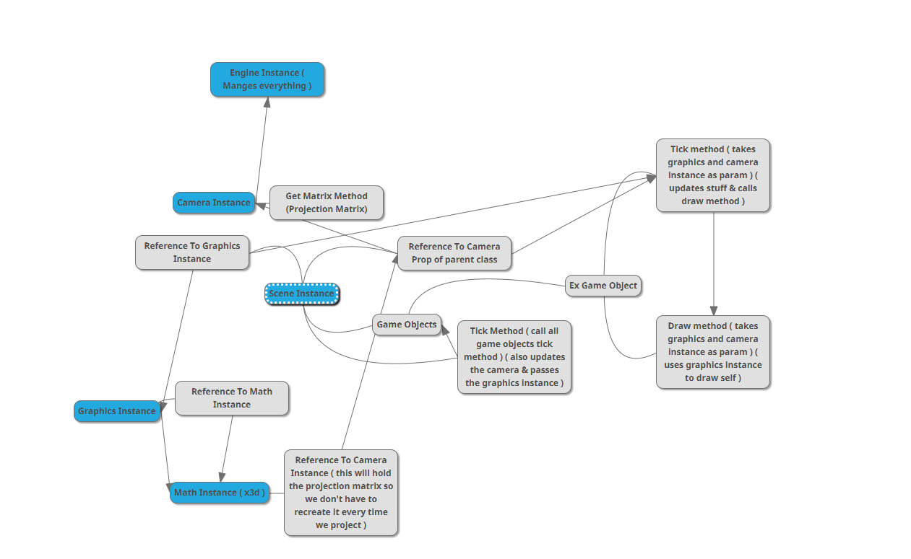
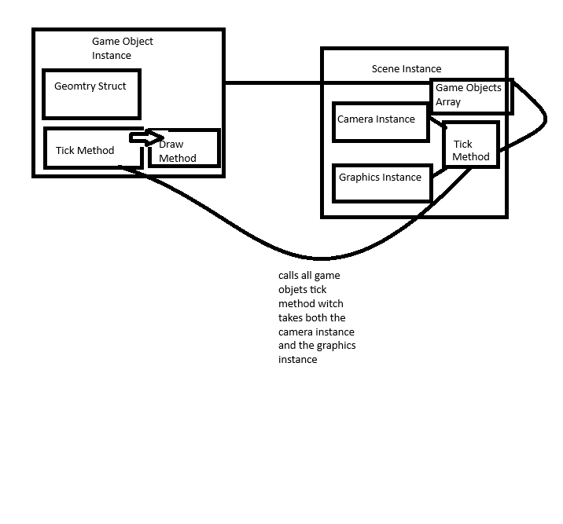

# thought map
https://app.mindmup.com/map/_free/2025/05/0713cba02f1211f0af9475f4c86a6425
the link will be the most recent version

# other diagrams
these are all of them they could be old
i just put them all here beacuse i want to see the evelotion of everything
